# 🔐 Secure IoT Device Lifecycle with ThingsBoard (mTLS + X.509)

> End-to-end secure onboarding of an IoT device: MQTT over TLS/mTLS with X.509
> certificates, a local PKI built with OpenSSL, **Auto-Provisioning**, and
> **Device Claiming** on the ThingsBoard platform — demonstrated with a
> simulated ESP32 sensor node in Wokwi.

<p align="left">
  
  
  
  
  
</p>

🌐 **Languages:** English (this file) · [فارسی / Persian](./README.fa.md)

---

## 📖 Overview

This project implements a slice of the **secure lifecycle of an IoT device**,
from secure transport and identity all the way to ownership transfer. A
simulated **ESP32** board (temperature + humidity sensor and a 16×2 I²C LCD)
connects to **ThingsBoard** through **MQTT over TLS**, authenticates itself with
an **X.509 client certificate (mutual TLS)**, registers itself automatically via
**Auto-Provisioning**, and is finally assigned to an end user through the
**Device Claiming** flow.


---

## ✨ Key Features

- **Local PKI with OpenSSL** — a self-signed Root CA that signs both the server
  and client certificates.
- **MQTT over TLS / mTLS** — encrypted transport plus two-way certificate
  authentication between the ESP32 and ThingsBoard.
- **X.509 identity** — the device proves its identity with an **ECDSA (P-256)**
  client certificate; the private key never leaves the device.
- **Auto-Provisioning** — new devices register automatically on first secure
  connection using the *X.509 Certificate Chain* strategy.
- **Device Claiming** — secure ownership transfer to a customer using a
  time-limited challenge code shown on the device LCD.
- **Security analysis** — a concrete comparison against a plain
  `MQTT + Access Token` setup (Eavesdropping, Credential Theft, Device
  Spoofing, MITM, Replay).

---

## 🧱 Architecture

```text
            ┌──────────────────────────┐        Chain of Trust
            │        Root CA           │  (signs server + client certs)
            │   (Trust Anchor, local)  │
            └────────────┬─────────────┘
                 signs   │   signs
          ┌──────────────┴───────────────┐
          ▼                               ▼
  ┌───────────────┐               ┌────────────────┐
  │  ESP32 client │   MQTTS /     │  ThingsBoard   │
  │  (Wokwi sim)  │──mTLS tunnel──│  server (JKS)  │
  │  DHT22 + LCD  │   (Pinggy)    │  Docker :8883  │
  └───────────────┘               └────────────────┘
     client cert (ECDSA)             server cert (RSA, SAN)
```

- **Root CA** — the trust anchor; both server and client certificates are
  signed by it.
- **ThingsBoard server** — proves its identity to the client with a server
  certificate loaded from a Java KeyStore (JKS).
- **ESP32 (Wokwi)** — proves its identity with an ECDSA client certificate
  (ECDSA avoids RSA timeouts inside the simulator).
- **Pinggy tunnel** — forwards the encrypted Layer-4 traffic to the internal
  ThingsBoard Docker port `8883` without terminating TLS.

---

## 🗂️ Repository Structure

```text
secure-iot-device-lifecycle/
├── README.md                        # English documentation (this file)
├── README.fa.md                     # Persian documentation
├── LICENSE                          # MIT license
├── .gitignore                       # Excludes private keys / keystores
│
├── certs/
│   ├── generate_certs.sh            # OpenSSL: Root CA + server + client certs
│   └── .gitkeep
│
├── thingsboard/
│   ├── docker-compose.override.yml  # Enables MQTT over TLS (KEYSTORE/JKS)
│   └── keystore-setup.sh            # Builds mqttserver.jks from the certs
│
├── firmware/
│   └── esp32/
│       ├── sketch.ino               # ESP32 mTLS + telemetry + claiming code
│       ├── diagram.json             # Wokwi wiring — placeholder included
│       └── libraries.txt            # Wokwi libraries — placeholder included
│
└── docs/
    └── images/                      # screenshots — see docs/images/README.md
```


---

## 🚀 Getting Started

### 1. Run ThingsBoard (Docker)
Start a ThingsBoard instance (Postgres variant) with Docker, following the
official installation docs.

### 2. Build the PKI
```bash
cd certs
chmod +x generate_certs.sh
./generate_certs.sh
```
This creates the Root CA (`ca.pem`), the server certificate (`server_chain.pem`
+ `server.key`) with a SAN extension, and the ESP32 ECDSA client certificate
(`esp32_ec.crt` + `esp32_ec_pkcs8.key`).

### 3. Enable MQTT over TLS on ThingsBoard
```bash
cd ../thingsboard
chmod +x keystore-setup.sh
./keystore-setup.sh                 # builds mqttserver.jks
docker compose up -d --force-recreate mytb
```
The `docker-compose.override.yml` binds port `8883` and points ThingsBoard at
the JKS keystore.

### 4. Open the Pinggy tunnel
Expose local port `8883` so the Wokwi client can reach the broker:
```bash
ssh -p 443 -R0:localhost:8883 tcp@a.pinggy.io
```
Use the generated public host/port in the firmware.

### 5. Flash the ESP32 (Wokwi)
- Open `firmware/esp32/sketch.ino` in Wokwi.
- Paste the contents of `ca.pem`, `esp32_ec.crt`, and `esp32_ec_pkcs8.key`
  into `CA_CERT`, `CLIENT_CERT`, and `CLIENT_KEY`.
- Set `MQTT_HOST` / `MQTT_PORT` to your Pinggy address.
- Run the simulation — the LCD shows the temperature/humidity and the claim
  code, and telemetry appears in ThingsBoard.

### 6. Auto-Provisioning
In **Device profiles → Device provisioning**, choose the **X.509 Certificates
Chain** strategy, paste `ca.pem`, set the CN regular expression to `(.*)`, and
enable **Allow creating new devices**. Any client presenting a certificate
signed by the Root CA is registered automatically.

### 7. Device Claiming
- The device publishes a claim request to `v1/devices/me/claim` with a
  time-limited `secretKey` (also shown on the LCD).
- A customer claims the device via the web UI or the API:
```bash
curl -s -X POST "http://localhost:8080/api/customer/device/esp32-dht-01/claim" \
  -H "X-Authorization: Bearer $CUSTOMER_TOKEN" \
  -H "Content-Type: application/json" \
  -d '{"secretKey":"<code-on-lcd>"}'
```
A `{"response":"SUCCESS"}` reply confirms ownership.

---

## 🛡️ Security Analysis — mTLS vs. plain Access Token

| Attack | MQTT + Access Token | Final system (mTLS over TLS) |
|---|---|---|
| **Eavesdropping** | ✅ Possible — data and token are sniffable | ❌ Blocked — all traffic is TLS-encrypted |
| **Credential Theft** | ✅ Possible — the token is a static, copyable string | ❌ Very hard — the private key never travels the network |
| **Device Spoofing** | ✅ Possible — anyone with the token impersonates the device | ❌ Impossible without the device's private key |
| **Man-in-the-Middle** | ✅ Possible — no server authentication | ❌ Blocked — client verifies the server via the CA |
| **Replay Attack** | ✅ Possible — no server validation | ❌ Blocked at the TLS layer; further reducible at the app layer |

---

## 🧰 Tech Stack

`ESP32` · `Wokwi` · `Arduino / C++` · `MQTT` · `TLS 1.2 / mTLS` · `X.509` ·
`OpenSSL` · `PKI` · `ThingsBoard` · `Docker` · `Pinggy` · `DHT22` · `I²C LCD`

---

## 📷 Screenshots

> All screenshots live in `docs/images/` (names listed in
> `docs/images/README.md`). They render below, grouped by lifecycle phase.

### 1. PKI & certificates (OpenSSL)
| Root CA & certificates | Generate ESP32 client cert | TLS handshake verified |
|---|---|---|
| 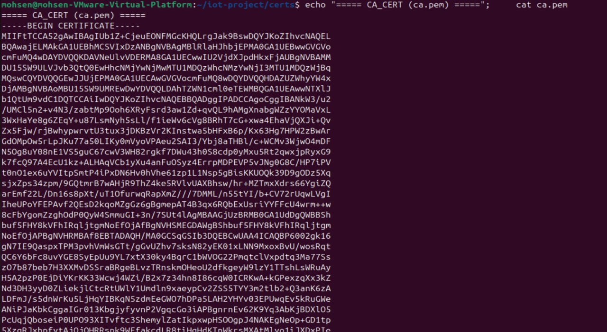 | 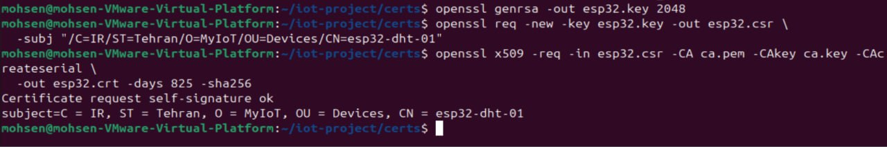 | 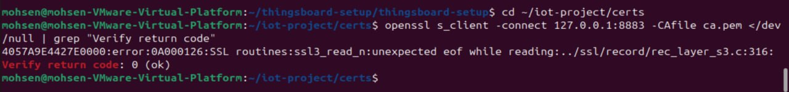 |

### 2. ThingsBoard over TLS (Docker)
| docker-compose TLS config | ThingsBoard running | Pinggy TLS tunnel |
|---|---|---|
| 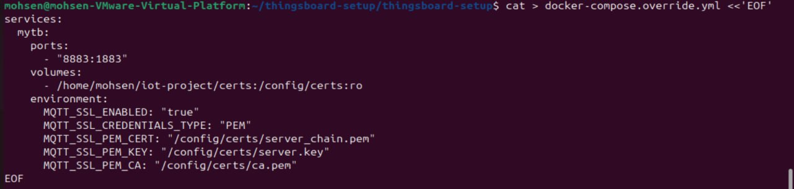 | 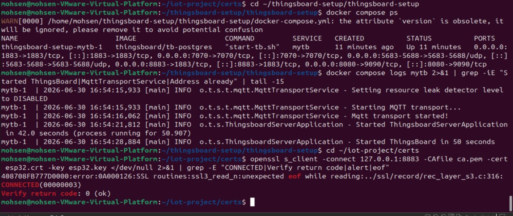 | 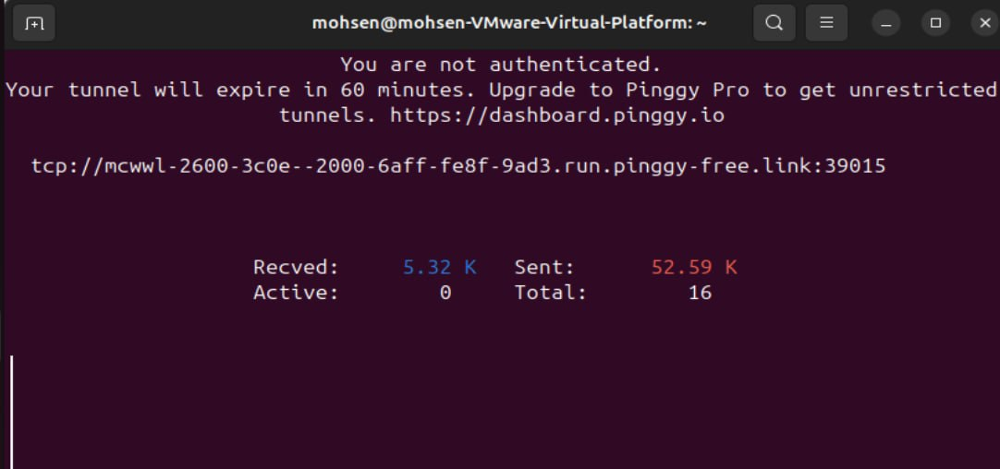 |

### 3. ESP32 device (Wokwi)
| Circuit (ESP32 + DHT22 + LCD) | Simulation running (mTLS) | Latest telemetry |
|---|---|---|
| 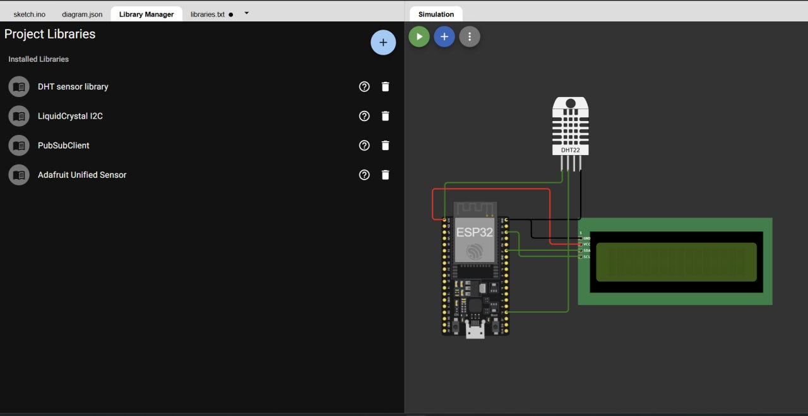 | 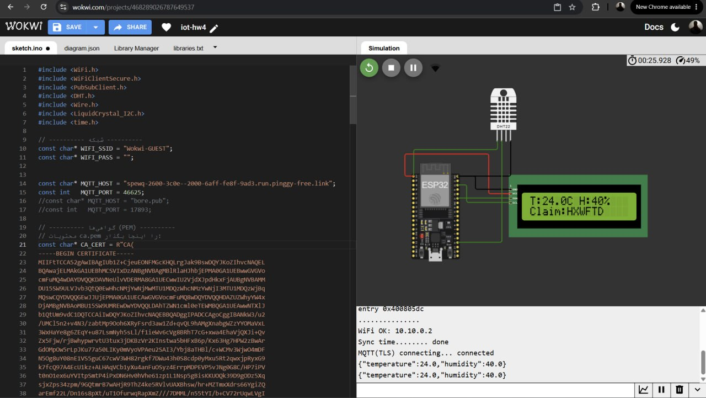 | 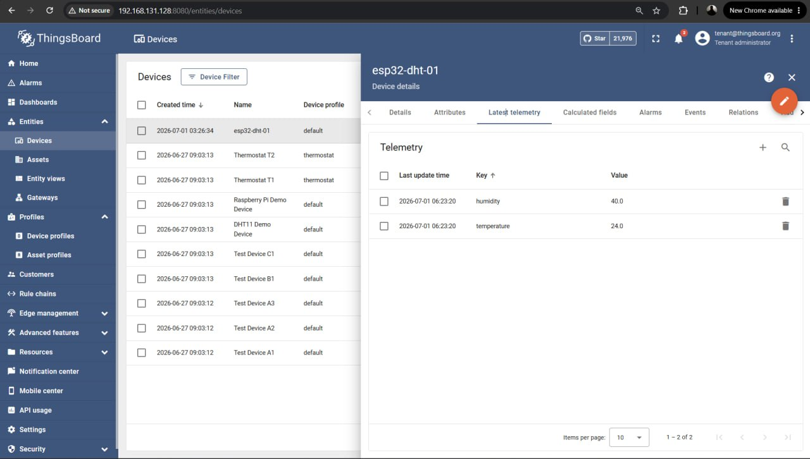 |

### 4. Device profile & auto-provisioning
| Device profile (MQTT) | X.509 provisioning strategy | Auto-provisioned device |
|---|---|---|
| 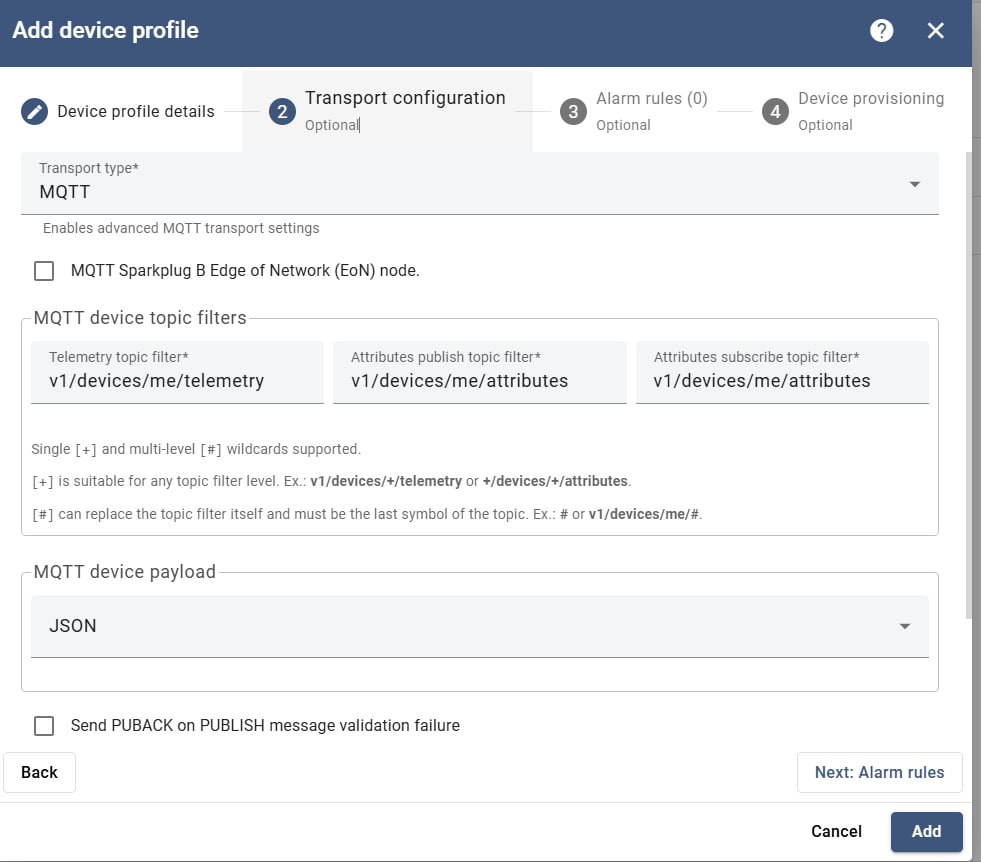 | 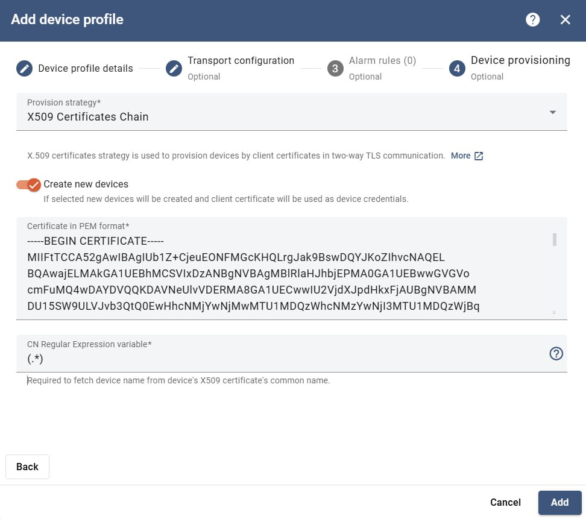 | 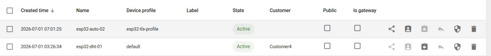 |

### 5. Telemetry, claiming & devices
| Auto-provision telemetry | Customer claiming flow | Device claimed (SUCCESS) |
|---|---|---|
| 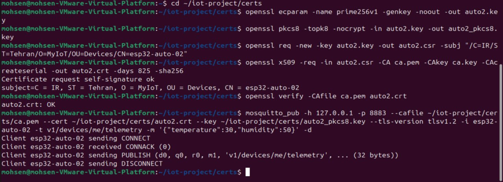 | 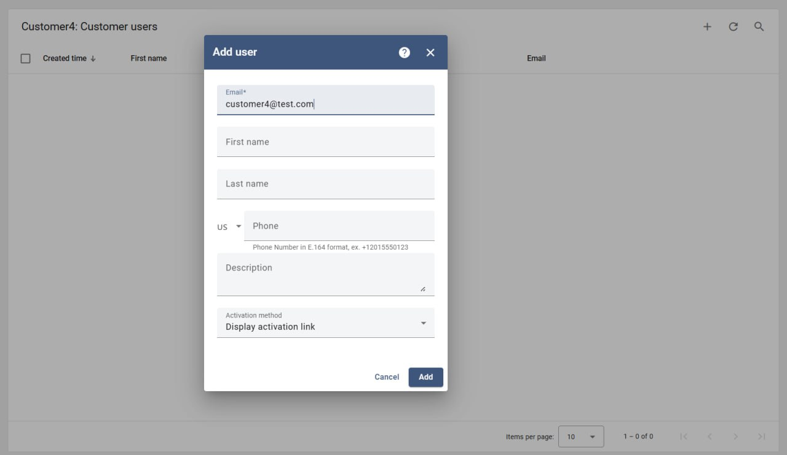 | 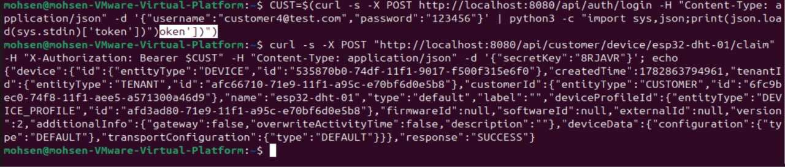 |

| Devices list + X.509 credentials |
|---|
| 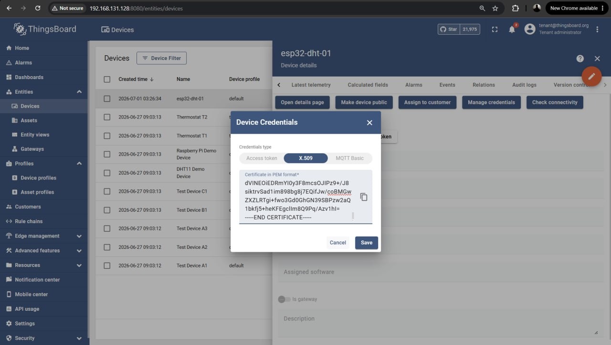 |

---


## 👤 Author

**Mohsen Norouzi (محسن نوروزی)**

- 🐙 GitHub: [@mohsen-norouzi237](https://github.com/mohsen-norouzi237)
- ✉️ Email: [mnorouzi2018@gmail.com](mailto:mnorouzi2018@gmail.com)
- 💼 LinkedIn: [mohsen-norouzi](https://www.linkedin.com/in/mohsen-norouzi-143bb5336/)


---

## 📝 License

Released under the [MIT License](./LICENSE).
